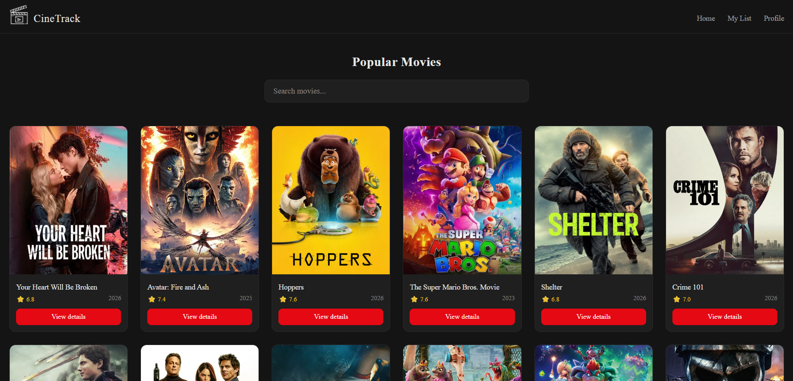
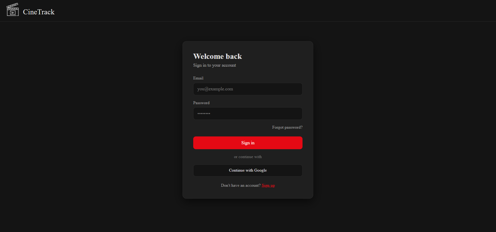
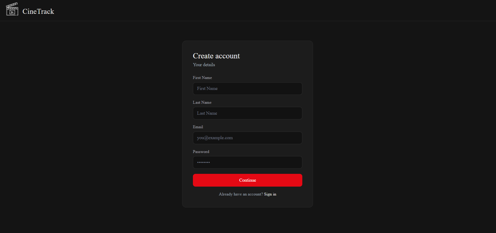
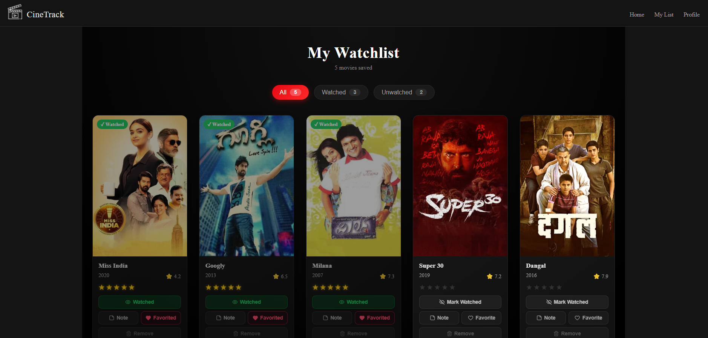
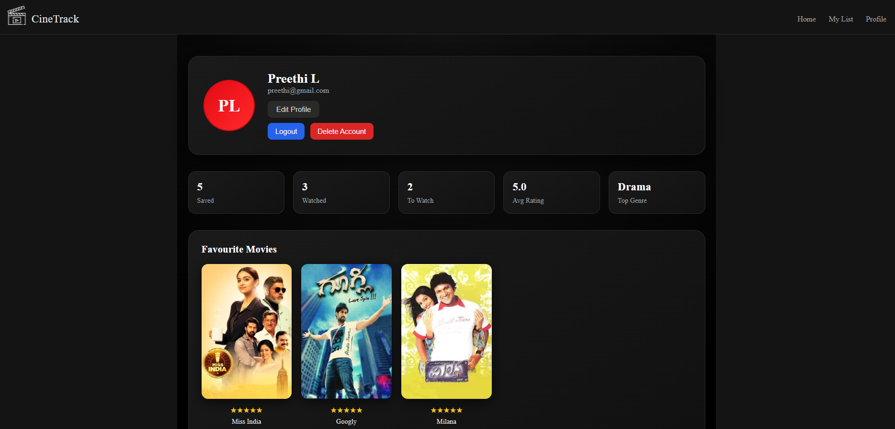
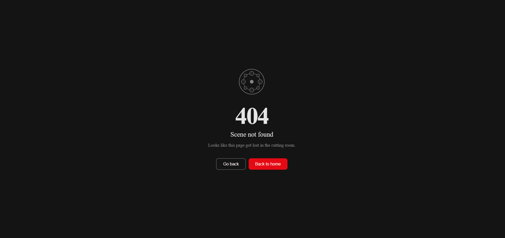

# 🎬 CineTrack


CineTrack is a modern React-based movie watchlist application that helps users discover movies, build personal watchlists, track watched films, and manage their viewing experience with ratings, notes, and favourites — all powered by the TMDB API.

---
##  Features

### Movie Discovery
- Browse popular movies powered by TMDB API  
- Search movies by title  

### Watchlist Management
- Add movies to your personal watchlist  
- Mark movies as watched / unwatched  
- Mark favourites and view them separately  

### Personalization
- Rate movies with a 5-star system  
- Add personal notes to movies  
- View stats like total saved, watched, average rating, and top genre  

### User System
- Signup and login functionality  
- Persistent session using localStorage  
- User profile with initials avatar  

### UI/UX
- Responsive design for all devices  
- Clean dark theme UI  
- Custom 404 page  

---

## Tech Stack

- React  
- React Router DOM  
- Context API  
- CSS Modules  
- TMDB API  
- localStorage  

---

## Project Structure

```bash
src/
├── components/
│   ├── Header.jsx
│   ├── Navbar.jsx
│   └── MovieCard.jsx
├── context/
│   └── WatchlistContext.jsx
├── pages/
│   ├── Home.jsx
│   ├── Detail.jsx
│   ├── MyList.jsx
│   ├── Profile.jsx
│   ├── Login.jsx
│   ├── Signup.jsx
│   ├── Settings.jsx
│   └── Error.jsx
├── App.jsx
└── main.jsx

## Getting Started

### 1️⃣ Clone the repository

```bash
git clone https://github.com/YOUR_USERNAME/cinetrack.git
cd cinetrack

###2️⃣ Install dependencies
npm install

###3️⃣ Setup environment variables

Create a .env file in the root directory:

VITE_TMDB_API_KEY=your_api_key_here

Get API key from:
👉 https://www.themoviedb.org/settings/api

###4️⃣ Run the project
npm run dev

Open in browser:

http://localhost:5173

##  Screenshots

### Main Pages
| Home | Movie Details |
| :---: | :---: |
|  |  |

---

### Authentication Pages
| Login | Signup |
| :---: | :---: |
|  |  |

---

### User Features
| My List | Profile |
| :---: | :---: |
|  |  |

---

### Error Page

| Error Page |
|------------|
|  |

	
### Note
This project uses localStorage for authentication and data persistence.
It is intended for learning and demo purposes only.

### Future Improvements
Backend authentication (Firebase / Node.js)
Cloud database for watchlist storage
Trailer integration (YouTube API)
Recommendation system
Social sharing of watchlists

### License
This project is licensed under the MIT License.

### Acknowledgements
TMDB API for movie data
React ecosystem for amazing tools

### Author
Built with ❤️ by Preethi Lokesh

	
